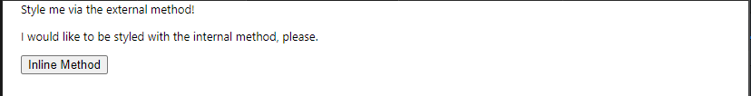
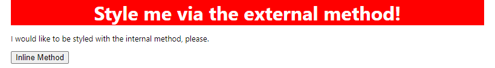
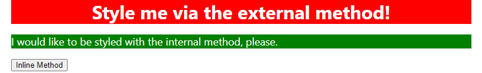
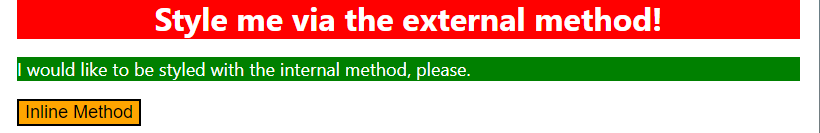
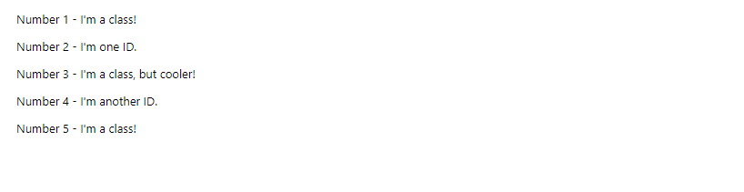
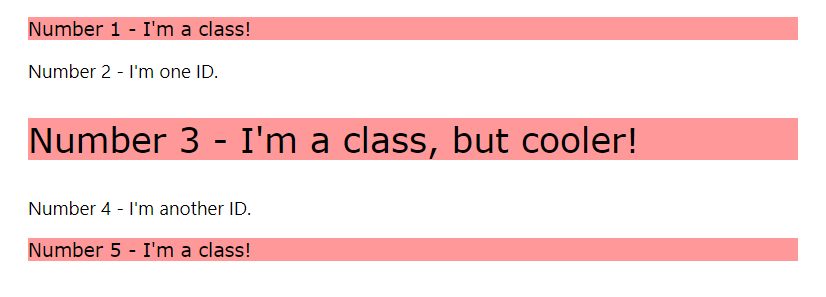
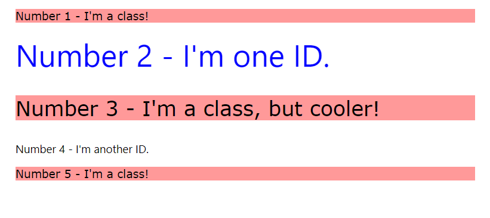
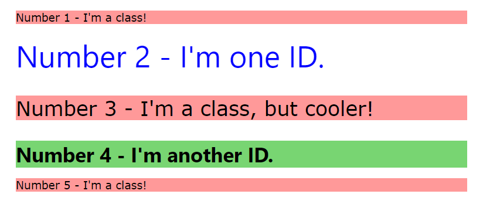

<link rel="stylesheet" href="styles.css">

# 🟪 CSS Exercises

* This is a fork created while I work through The Odin Project. I created this fork on 18/06/2023

# 🧠 CSS Foundations

## 👨‍💻 Exercise 1: CSS Methods 👨‍💻 

### 📜 Instructions 📜

* In this exercise, I'll practice adding CSS to HTML files using external, internal and inline CSS.

* I should only use type selectors for this exercise and use keywords for specifying colors.

* The properties I need to add to each element are:

1) `div`: a red background, white text, 32px font-size, center aligned, and bold

2) `p`: a green background, white text, and a 18px font-size

3) `button`: orange background and 18px font-size

* The desired outcome is:


### 🔴 Commentatry

* I start working on exercise 1 [here](/foundations-solutions/01-css-methods/) 

* It starts off looking like:



* I create a CSS file ([styles.css](/foundations-solutions/01-css-methods/styles.css))

* I write the following CSS:

```css
div {
    background-color: red;
    font-size: 32px;
    color: white;
    text-align: center;
    font-weight: bold;
}
```

* I create the link to the CSS file in the HTML!

* This generates the following output:




* I then add an internal CSS rule for the `p` element:

```css
<style>
    p {
    background-color: green;
    color: white;
    font-size: 18px;
    }
</style>
```

* This generates the following output:



* I apply inline style to the button element:

```html
<button style="background-color: orange; font-size: 18px;">Inline Method</button>
```

* This generates the following output:



<hr>

## 👨‍💻 Exercise 2: Class and ID Selectors 👨‍💻 

### 📜 Instructions 📜

* There are several elements in the [HTML file](/foundations-solutions/02-class-id-selectors/index.html), which I will add either class/id attributes as noted in outcome image below:

.

* The properties which I need to add to each element are:

1) All odd numbered elements: a light red/pink background, a list of fonts containing `Verdana`, `DejaVu Sans` with `sans-serif` as a fallback

2) The second element: blue text and a font-size of 36px

3) The third elemenent: in addition to first property, add a font-size of 24px

4) The fourth element: a light green background, font-size 24px and bold

### 🔴 Commentatry

* The page looks like:



* I target all the `p` elements and make the background light pink:

```css
p {
    background-color: hsl(0, 100%, 80%);
    font-family: Verdana, 'DejaVu Sans', sans-serif
}
```

* I then added a class to the second `p` element:

```html
<!-- index.html --->
  <body>
    <p>Number 1 - I'm a class!</p>
    <div>Number 2 - I'm one ID.</div>
    <p class="odd">Number 3 - I'm a class, but cooler!</p>
    <div>Number 4 - I'm another ID.</div>
    <p>Number 5 - I'm a class!</p>
  </body>
```

* I add to the CSS rules

```css
p {
    background-color: hsl(0, 100%, 80%);
    font-family: Verdana, 'DejaVu Sans', sans-serif
}
.odd {
    font-size: 24px;
}
```

* This generates the following output:



* I add an ID to "Number 2":

```html
 <body>
    <p>Number 1 - I'm a class!</p>
    <div id="blue">Number 2 - I'm one ID.</div> <!-- HERE -->
    <p class="odd">Number 3 - I'm a class, but cooler!</p>
    <div>Number 4 - I'm another ID.</div>
    <p>Number 5 - I'm a class!</p>
  </body>
```

* And define the following CSS:

```css
#blue {
    color: blue;
    font-size: 36px;
}
```

* This generates the following output:



* I add an ID to "Number 4":

```html
  <body>
    <p>Number 1 - I'm a class!</p>
    <div id="blue">Number 2 - I'm one ID.</div>
    <p class="odd">Number 3 - I'm a class, but cooler!</p>
    <div id="green">Number 4 - I'm another ID.</div>
    <p>Number 5 - I'm a class!</p>
  </body>
```

* I define the CSS as:

```css
#green {
    background-color: hsl(116, 54%, 64%);
    font-size: 24px;
    font-weight: bold;
}
```

* I change the HTML such that the `p` elements have the same class:

```html
  <body>
    <p class="odd">Number 1 - I'm a class!</p>
    <div id="blue">Number 2 - I'm one ID.</div>
    <p class="odd cooler">Number 3 - I'm a class, but cooler!</p>
    <div id="green">Number 4 - I'm another ID.</div>
    <p class="odd">Number 5 - I'm a class!</p>
  </body>
```

* And update the CSS to: 

```css
.odd {
    background-color: hsl(0, 100%, 80%);
    font-family: Verdana, 'DejaVu Sans', sans-serif
}
.cooler {
    font-size: 24px;
}
#blue {
    color: blue;
    font-size: 36px;
}
#green {
    background-color: hsl(116, 54%, 64%);
    font-size: 24px;
    font-weight: bold;
}
```

* The output is:



<hr>

## 👨‍💻 Exercise 3: Grouping Selectors 👨‍💻 

### 📜 Instructions 📜

* We shall build off the previous exercise. Instead of having a single element with two different rules applie, we shall instead have 2 elements with unqiue class names.

* The properties you need to add to each element are:

1) The first element: a black background a white text.
2) The second element: ae yellow background
3) Both elements: a font size of 28px, and a font-list of `Helvetica`, `Times new Roman` with `sans-serif` as fallback

* The desired outcome is:


* Self-check:

1) Does each element have a unqiue class name?

2) Did you use the grouping selector for styles that both elements share?

3) Did you make seperate rules for the styles unique to each element.