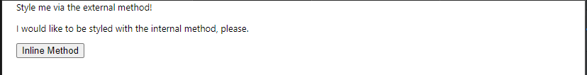
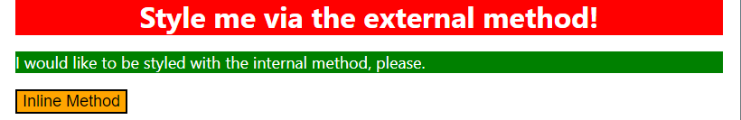

# 🟪 CSS Exercises

* This is a fork created while I work through The Odin Project. I created this fork on 18/06/2023

## 🧠 CSS Foundations

### 👨‍💻 Exercise 1: CSS Methods 👨‍💻 

#### 📜 Instructions 📜

* In this exercise, I'll practice adding CSS to HTML files using external, internal and inline CSS.

* I should only use type selectors for this exercise and use keywords for specifying colors.

* The properties I need to add to each element are:

1) `div`: a red background, white text, 32px font-size, center aligned, and bold

2) `p`: a green background, white text, and a 18px font-size

3) `button`: orange background and 18px font-size

* The desired outcome is:


#### 🟦 Commentatry

* I start working on exercise 1 [here](/foundations-solutions/01-css-methods/) 

* It starts off looking like:



* I create a CSS file ([styles.css](/foundations-solutions/01-css-methods/styles.css))

* I write the following CSS:

```css
div {
    background-color: red;
    font-size: 32px;
    color: white;
    text-align: center;
    font-weight: bold;
}
```

* I create the link to the CSS file in the HTML!

* This generates the following output:


* I then add an internal CSS rule for the `p` element:

```css
<style>
    p {
    background-color: green;
    color: white;
    font-size: 18px;
    }
</style>
```

* This generates the following output:


* I apply inline style to the button element:

```html
<button style="background-color: orange; font-size: 18px;">Inline Method</button>
```

* This generates the following output:

