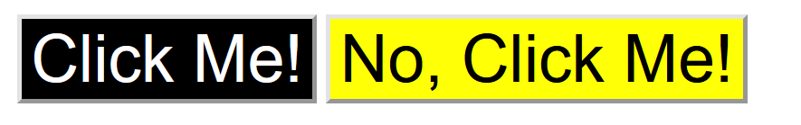
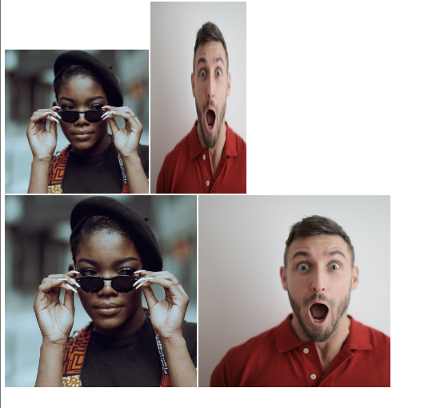
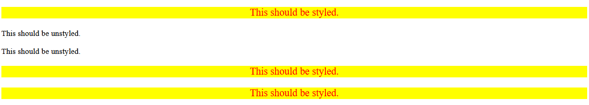

<link rel="stylesheet" href="styles.css">

# 🟪 CSS Exercises

* This is a fork created while I work through The Odin Project. I created this fork on 18/06/2023

# 🧠 CSS Foundations

## 👨‍💻 Exercise 1: CSS Methods 👨‍💻 

### 📜 Instructions 📜

* In this exercise, I'll practice adding CSS to HTML files using external, internal and inline CSS.

* I should only use type selectors for this exercise and use keywords for specifying colors.

* The properties I need to add to each element are:

1) `div`: a red background, white text, 32px font-size, center aligned, and bold

2) `p`: a green background, white text, and a 18px font-size

3) `button`: orange background and 18px font-size

* The desired outcome is:


### 🔴 Commentatry

* I start working on exercise 1 [here](/foundations-solutions/01-css-methods/) 

* It starts off looking like:


* I create a CSS file ([styles.css](/foundations-solutions/01-css-methods/styles.css))

* I write the following CSS:

```css
div {
    background-color: red;
    font-size: 32px;
    color: white;
    text-align: center;
    font-weight: bold;
}
```

* I create the link to the CSS file in the HTML!

* This generates the following output:


* I then add an internal CSS rule for the `p` element:

```css
<style>
    p {
    background-color: green;
    color: white;
    font-size: 18px;
    }
</style>
```

* This generates the following output:


* I apply inline style to the button element:

```html
<button style="background-color: orange; font-size: 18px;">Inline Method</button>
```

* This generates the following output:


<hr>

## 👨‍💻 Exercise 2: Class and ID Selectors 👨‍💻 

### 📜 Instructions 📜

* There are several elements in the [HTML file](/foundations-solutions/02-class-id-selectors/index.html), which I will add either class/id attributes as noted in outcome image below:

.

* The properties which I need to add to each element are:

1) All odd numbered elements: a light red/pink background, a list of fonts containing `Verdana`, `DejaVu Sans` with `sans-serif` as a fallback

2) The second element: blue text and a font-size of 36px

3) The third elemenent: in addition to first property, add a font-size of 24px

4) The fourth element: a light green background, font-size 24px and bold

### 🔴 Commentatry

* The page looks like:


* I target all the `p` elements and make the background light pink:

```css
p {
    background-color: hsl(0, 100%, 80%);
    font-family: Verdana, 'DejaVu Sans', sans-serif
}
```

* I then added a class to the second `p` element:

```html
<!-- index.html --->
  <body>
    <p>Number 1 - I'm a class!</p>
    <div>Number 2 - I'm one ID.</div>
    <p class="odd">Number 3 - I'm a class, but cooler!</p>
    <div>Number 4 - I'm another ID.</div>
    <p>Number 5 - I'm a class!</p>
  </body>
```

* I add to the CSS rules

```css
p {
    background-color: hsl(0, 100%, 80%);
    font-family: Verdana, 'DejaVu Sans', sans-serif
}
.odd {
    font-size: 24px;
}
```

* This generates the following output:


* I add an ID to "Number 2":

```html
 <body>
    <p>Number 1 - I'm a class!</p>
    <div id="blue">Number 2 - I'm one ID.</div> <!-- HERE -->
    <p class="odd">Number 3 - I'm a class, but cooler!</p>
    <div>Number 4 - I'm another ID.</div>
    <p>Number 5 - I'm a class!</p>
  </body>
```

* And define the following CSS:

```css
#blue {
    color: blue;
    font-size: 36px;
}
```

* This generates the following output:


* I add an ID to "Number 4":

```html
  <body>
    <p>Number 1 - I'm a class!</p>
    <div id="blue">Number 2 - I'm one ID.</div>
    <p class="odd">Number 3 - I'm a class, but cooler!</p>
    <div id="green">Number 4 - I'm another ID.</div>
    <p>Number 5 - I'm a class!</p>
  </body>
```

* I define the CSS as:

```css
#green {
    background-color: hsl(116, 54%, 64%);
    font-size: 24px;
    font-weight: bold;
}
```

* I change the HTML such that the `p` elements have the same class:

```html
  <body>
    <p class="odd">Number 1 - I'm a class!</p>
    <div id="blue">Number 2 - I'm one ID.</div>
    <p class="odd cooler">Number 3 - I'm a class, but cooler!</p>
    <div id="green">Number 4 - I'm another ID.</div>
    <p class="odd">Number 5 - I'm a class!</p>
  </body>
```

* And update the CSS to: 

```css
.odd {
    background-color: hsl(0, 100%, 80%);
    font-family: Verdana, 'DejaVu Sans', sans-serif
}
.cooler {
    font-size: 24px;
}
#blue {
    color: blue;
    font-size: 36px;
}
#green {
    background-color: hsl(116, 54%, 64%);
    font-size: 24px;
    font-weight: bold;
}
```

* The output is:


<hr>

## 👨‍💻 Exercise 3: Grouping Selectors 👨‍💻 

### 📜 Instructions 📜

* We shall build off the previous exercise. Instead of having a single element with two different rules applie, we shall instead have 2 elements with unqiue class names.

* The properties you need to add to each element are:

1) The first element: a black background a white text.
2) The second element: ae yellow background
3) Both elements: a font size of 28px, and a font-list of `Helvetica`, `Times new Roman` with `sans-serif` as fallback

* The desired outcome is:


* Self-check:

1) Does each element have a unqiue class name?

2) Did you use the grouping selector for styles that both elements share?

3) Did you make seperate rules for the styles unique to each element.

### 🔴 Commentatry

* I copy the exercise 3 folder into [foundations-solutions](/foundations-solutions/03-grouping-selectors/)

* The `index.html` has the following HTML:

```html
<!DOCTYPE html>
<html lang="en">
  <head>
    <meta charset="UTF-8">
    <meta http-equiv="X-UA-Compatible" content="IE=edge">
    <meta name="viewport" content="width=device-width, initial-scale=1.0">
    <title>Grouping Selectors</title>
    <link rel="stylesheet" href="style.css">
  </head>
  <body>
    <button>Click Me!</button>
    <button>No, Click Me!</button>
  </body>
</html>
```

* The `styles.css` file is empty

* I add classes to each of the button elements:

```html
  <body>
    <button class="click">Click Me!</button>
    <button class="no">No, Click Me!</button>
  </body>
```

* I then define the CSS as:

```css
.click, .no {
    font-size: 28px;
    font-family: Helvetica, 'Times New Roman', sans-serif;
}
.click {
    background-color: black;
    color: white;
}
.no {
    background-color: rgb(255, 255, 6);
    color: black;
}
```

* This produces the following output:



* The solution given is same as mine! 

<hr>

## 👨‍💻 Exercise 4: Chaining Selectors 👨‍💻 

### 📜 Instructions 📜

* For this exercise, the HTML file is complete so I only need to update the CSS file.

* There are two images which need to be styled. Each with two class names and one of them being shared. The goal is to chain the selectors for both elements, so that you have a unique style applied.

* The properties which need to be added to the elements are:

1) Make both the `avatar` and `proportioned` classes 300 pixels wide, then give it a height so it stays in proportion!.

2) Make both the `avatar` and `distorted` classes 200px wide, the make its height twice as big as its width!

* The desired outcome is:


* Self Check:

1) Did your properly chain class selectors for each rule?
2) Does the `proportioned` image retain its original square proportions?
3) Does the `distorted` image end up looking squished and distorted?

### 🔴 Commentatry

* The `index.html` file has the following elements:

```html
  <body>
    <!-- Use the classes BELOW this line -->
    <div>
      
      
    </div>
    <!-- Use the classes ABOVE this line -->
    <div>
      
      
    </div>
  </body>
```

* I define the CSS as:

```css
  .avatar.proportioned {
    width: 300px;
    height: auto;
}
.avatar.distorted {
    width: 200px;
    height: 400px;
}
```

* Originally it was not working, as I had a space between the chains!!

* This produces the following output:



* The solution was the same!

## 👨‍💻 Exercise 5: Descendant Combinator 👨‍💻 

### 📜 Instructions 📜

* The goal of this exercise if to apply styles to elements that are descendants of another element, while leaving elements that aren't descendants of the elements unstyled.

* The HTML file is set up, only the CSS needs changing.

* The properties you need to add are:

1) Only `p` elements that are descendants of the `div` elements should have a yellow backgound and red font, a font-szie of 20px, a center allignment.

* The desired outcome is:


* Self Check:

1) Do the elements with "This should be styled" have the correct applied styles?

2) Do the elements with "This should be unstyled" have no styles applied?

### 🔴 Commentatry

* The files for this exercise have been copied [here](/foundations-solutions/05-descendant-combinator/)

* The `index.html` is initialised as:

```html
<!DOCTYPE html>
<html lang="en">
  <head>
    <meta charset="UTF-8">
    <meta http-equiv="X-UA-Compatible" content="IE=edge">
    <meta name="viewport" content="width=device-width, initial-scale=1.0">
    <title>Descendant Combinator</title>
    <link rel="stylesheet" href="style.css">
  </head>
  <body>
    <div class="container">
      <p class="text">This should be styled.</p>
    </div>
    <p class="text">This should be unstyled.</p>
    <p class="text">This should be unstyled.</p>
    <div class="container">
      <p class="text">This should be styled.</p>
      <p class="text">This should be styled.</p>
    </div>
  </body>
</html>
```

* The `style.css` is empty

* I update the CSS to:

```css
div p {
    background-color: yellow;
    color: red;
    font-size: 20px;
    text-align: center;
}
```

* This produces the following output:



* Looking at the solution, we could've specified the CSS rule as:

```css
.container .text {}
div p {}
div .text {}
.container p {}
```